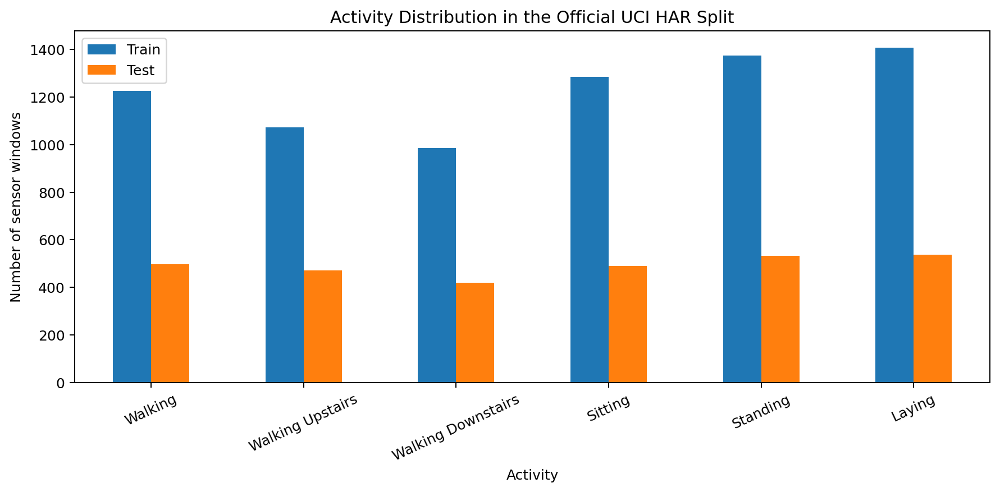
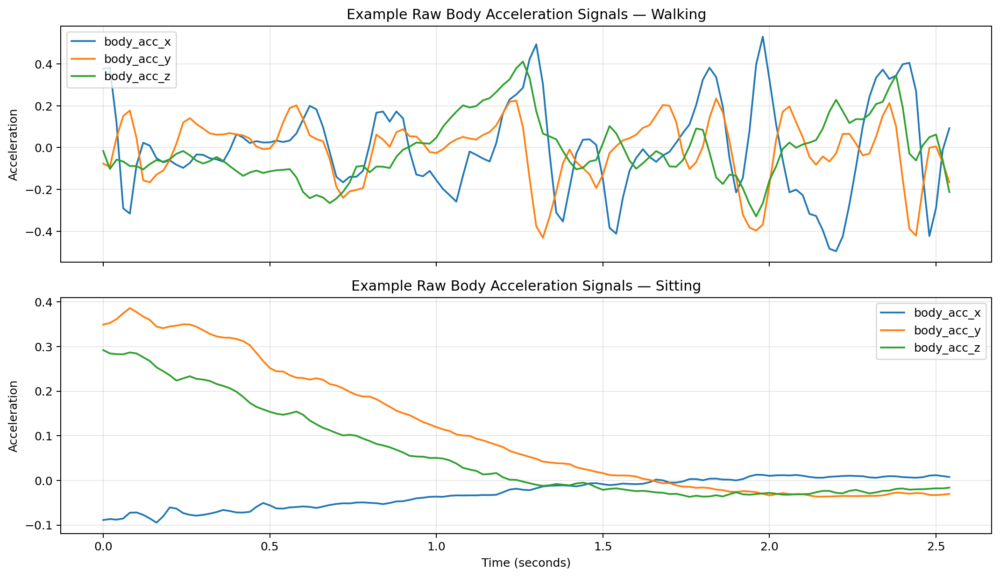
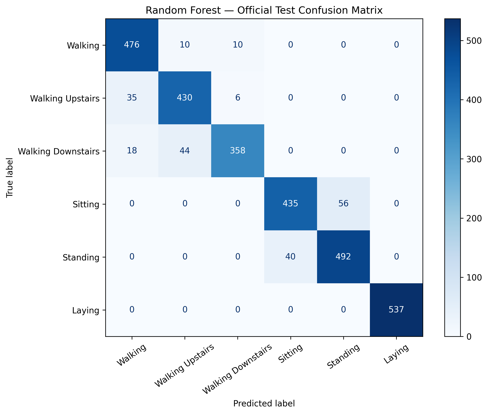
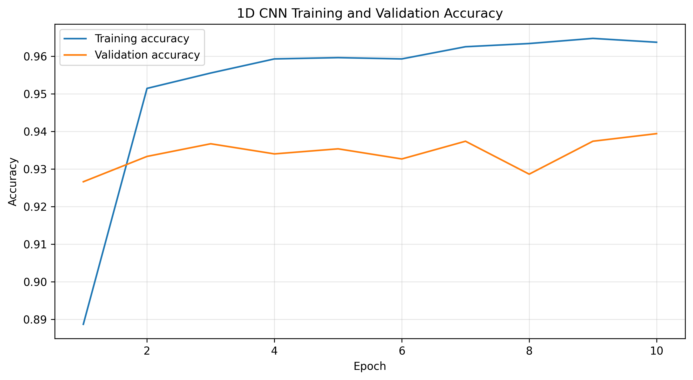
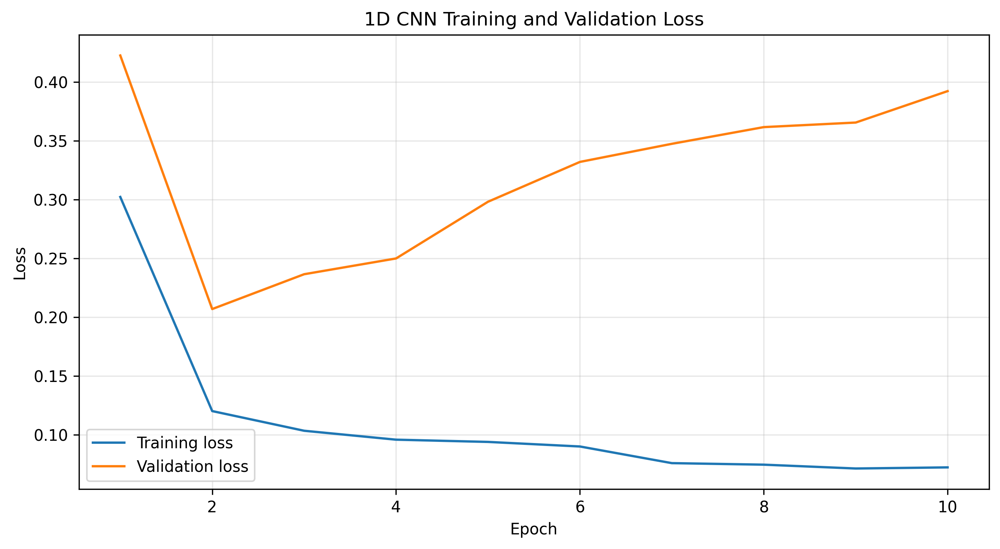
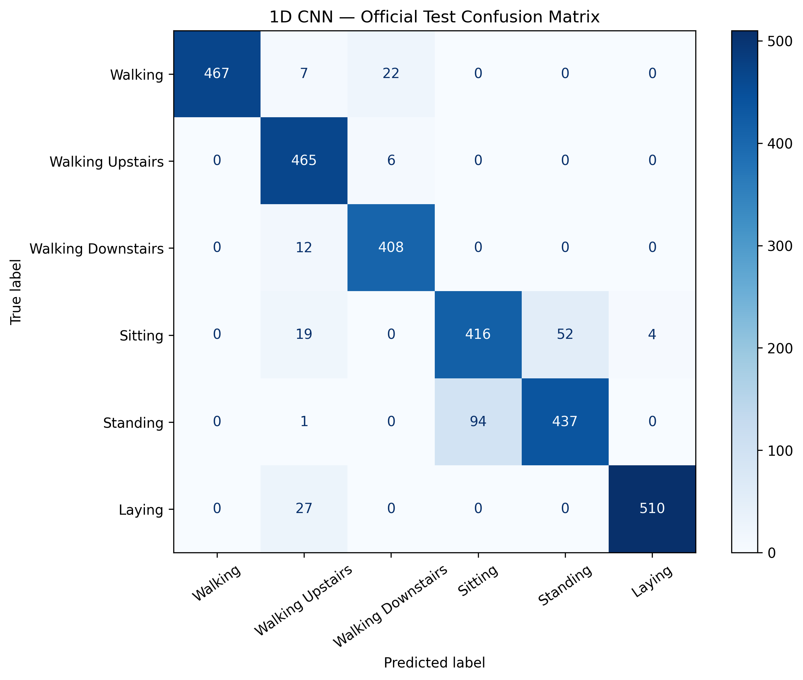
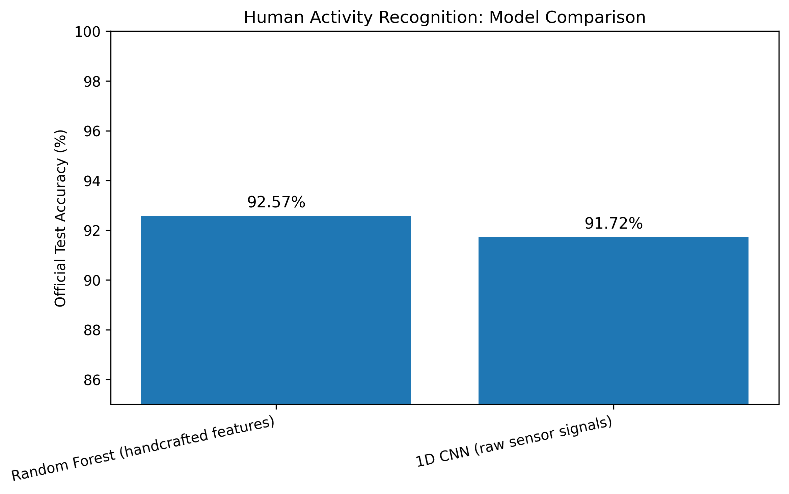

# Human Activity Recognition from Smartphone Sensor Signals using 1D CNN

A machine learning and deep learning project that classifies six human activities from smartphone inertial sensor signals.

This project compares:

- **Random Forest** trained on 561 handcrafted features
- **1D CNN** trained directly on raw 9-channel sensor sequences

## Objective

Main question:

> Can a 1D CNN learn activity patterns directly from raw smartphone sensor signals, and how does it compare with a Random Forest that uses handcrafted features?

## Activities Classified

1. Walking  
2. Walking Upstairs  
3. Walking Downstairs  
4. Sitting  
5. Standing  
6. Laying  

## Why This Project Is Useful

Human Activity Recognition can be used in:

- Fitness tracking
- Smartwatch activity monitoring
- Elderly mobility monitoring
- Rehabilitation tracking
- Patient movement monitoring
- Fall-risk monitoring
- Sports movement analysis
- Workplace safety systems
- Smart-home automation
- Wearable healthcare systems

This project does not diagnose medical conditions. It demonstrates the activity-recognition pipeline that can be used as a component in mobility and health-monitoring systems.

## Dataset

Dataset: **UCI Human Activity Recognition Using Smartphones Dataset**

| Item | Value |
|---|---:|
| Participants | 30 |
| Total activity windows | 10,299 |
| Training samples | 7,352 |
| Test samples | 2,947 |
| Activity classes | 6 |
| Sampling frequency | 50 Hz |
| Window length | 128 time steps |
| Window duration | Approximately 2.56 seconds |
| Raw sensor channels | 9 |
| Handcrafted features | 561 |

The official train-test split is subject-disjoint. Test subjects are different from training subjects.

This is important because the model must generalize to unseen people instead of memorizing movement patterns from people already present in training data.

## Input Representations

### Raw Sensor Sequences for 1D CNN

Each raw input sample has shape:

```text
(128 time steps, 9 sensor channels)
```

The 9 channels are:

- Body acceleration X, Y, Z
- Body gyroscope X, Y, Z
- Total acceleration X, Y, Z

Raw data shapes:

```text
Training raw signals: (7352, 128, 9)
Test raw signals:     (2947, 128, 9)
```

The CNN receives only raw sensor values. It does not receive manually engineered features.

### Handcrafted Features for Random Forest

The Random Forest receives 561 precomputed features.

```text
Training engineered features: (7352, 561)
Test engineered features:     (2947, 561)
```

The handcrafted features include:

- Mean
- Standard deviation
- Minimum and maximum
- Signal energy
- Entropy
- Correlation
- Signal magnitude area
- Frequency-domain features
- FFT-based features
- Acceleration and gyroscope statistics

## Exploratory Data Analysis

Before training, the dataset was inspected to understand class balance and raw sensor behavior.

### Class Distribution

The six activities were reasonably balanced in both the training and test partitions.

This is useful because no single activity dominates the dataset. Therefore, accuracy is meaningful, and Macro F1 score is also reported to measure performance fairly across all classes.



### Raw Signal Analysis

Raw body-acceleration signals were compared for Walking and Sitting.



Key observations:

- Walking signals show stronger and repeated fluctuations.
- Sitting signals are smoother and have lower variation.
- Dynamic activities contain more periodic movement patterns.
- Static activities contain lower-motion and more stable patterns.

This supports the use of a 1D CNN because convolution filters can learn temporal patterns directly from sensor sequences.

## Data Preparation

### Random Forest Input

The Random Forest used the 561 engineered features provided by the dataset.

```text
Training features: (7352, 561)
Test features:     (2947, 561)
```

No scaling was required because Random Forest is a tree-based model and is not strongly affected by different feature scales.

### CNN Input

The CNN used raw sensor sequences.

```text
Input shape: (128 time steps, 9 sensor channels)
```

A subject-aware validation split was created from the official training data.

```text
CNN training samples:   5867
CNN validation samples: 1485
CNN test samples:       2947
Validation subjects:    27, 28, 29, 30
```

The official test set was kept untouched until final evaluation.

## Why Subject-Aware Validation Was Used

A normal random train-validation split can place windows from the same person in both training and validation data.

This creates subject leakage.

Subject leakage can make validation accuracy unrealistically high because the model may learn person-specific movement patterns instead of general activity patterns.

People can differ in:

- Walking rhythm
- Body movement
- Phone placement
- Gait pattern
- Sitting and standing posture

Using complete unseen subjects for validation gives a more realistic estimate of model performance.

The same subject-aware validation split was used for both Random Forest and CNN to keep the comparison fair.

## CNN Normalization

The raw sensor channels were standardized using statistics calculated only from the CNN training partition.

```text
Normalized training mean: approximately 0
Normalized training standard deviation: approximately 1
```

The same training mean and standard deviation were applied to validation and test data.

Normalization was required because accelerometer and gyroscope channels can have different numerical ranges. Without normalization, channels with larger values can dominate neural network training.

Test data was not used to calculate normalization values because that would create data leakage.


## Random Forest Baseline

The first model was a Random Forest classifier trained on the dataset's 561 handcrafted features.

## Why Random Forest Was Used

Random Forest was selected as the classical baseline because:

- It performs strongly on structured tabular data.
- It can learn non-linear relationships between features.
- It works well with many input features.
- It is robust compared with a single decision tree.
- It does not require feature scaling.
- It is a strong baseline for comparing against a deep-learning model.

The 561 handcrafted features already contain manually designed information about the sensor signals. Therefore, Random Forest is expected to be a strong model on this dataset.

## Model Selection

To keep the project simple and avoid unnecessary hyperparameter tuning, only two small configurations were compared using the subject-aware validation split.

```text
Configuration 1:
n_estimators = 200

Configuration 2:
n_estimators = 300
```

The model with 200 trees achieved the better validation result and was selected.

After selecting the configuration, the Random Forest was retrained using the complete official training partition and evaluated once on the untouched official test partition.

## Random Forest Results

| Metric | Result |
|---|---:|
| Validation Accuracy | **95.35%** |
| Official Test Accuracy | **92.57%** |
| Macro F1 Score | **92.38%** |



## Random Forest Error Analysis

The Random Forest performed especially well on Laying and achieved strong overall performance across all six activities.

The main difficult activity pairs were:

- Walking vs Walking Upstairs
- Walking vs Walking Downstairs
- Sitting vs Standing

These errors are understandable because:

- Walking, walking upstairs, and walking downstairs all contain repeated leg movement and periodic acceleration patterns.
- Sitting and standing are both low-motion activities, so their sensor signals can overlap.
- Different subjects may hold or carry the phone differently, which changes the measured signal pattern.

## Why Random Forest Performed So Well

The Random Forest achieved the highest test accuracy because it received 561 handcrafted features.

These features already encode useful domain knowledge, including:

- How much the body is moving.
- Whether movement is periodic.
- Signal variation over time.
- Frequency patterns related to walking motion.
- Differences between static and dynamic activities.
- Relationships between acceleration and gyroscope signals.

The Random Forest does not need to discover all of this information from raw values. The useful properties have already been calculated and provided as input.

## Advantages of Random Forest in This Project

- Achieved the best official test accuracy.
- Works well with a limited dataset.
- Uses strong domain-specific features.
- Trains faster than the CNN.
- Requires less computational power.
- Is easier to apply when reliable handcrafted features are available.

## Limitations of Random Forest

- Requires manual feature engineering.
- Depends heavily on domain knowledge.
- Cannot directly learn temporal patterns from raw sequences.
- Feature engineering may need to be redesigned if sensor placement, device type, or sampling frequency changes.
- Creating hundreds of useful features can be expensive and time-consuming in real-world applications.

---


## 1D CNN Model

The second model was a 1D Convolutional Neural Network trained directly on raw smartphone sensor signals.

Unlike the Random Forest, the CNN did not use the 561 handcrafted features.

The CNN input was:

```text
(128 time steps, 9 sensor channels)
```

The CNN had to learn useful movement patterns directly from raw sensor values.

## Why 1D CNN Was Used

A 1D CNN is suitable for multivariate time-series sensor data because it can learn local patterns across time.

For human activity recognition, the CNN can learn:

- Repeated acceleration cycles during walking
- Motion changes during walking upstairs and downstairs
- Low-motion patterns during sitting and standing
- Stable orientation patterns during laying
- Relationships between accelerometer and gyroscope channels

The convolution filters move across the time dimension and detect meaningful local sensor patterns.

## CNN Architecture

The CNN architecture was intentionally kept simple to make the project understandable, reproducible, and less likely to overfit.

```text
Input: (128 time steps, 9 channels)

Conv1D: 64 filters, kernel size 5
Batch Normalization
Max Pooling

Conv1D: 128 filters, kernel size 5
Batch Normalization
Max Pooling

Conv1D: 128 filters, kernel size 3
Batch Normalization

Global Average Pooling
Dropout: 0.30

Dense Layer: 64 units, ReLU
Dropout: 0.20

Output Layer: 6 units, Softmax
```

Total trainable parameters: approximately **103,238**

## Why These Layers Were Used

### Conv1D Layers

Conv1D layers learn temporal patterns from sensor signals.

For example, they can detect repeated acceleration peaks during walking and more stable low-variation patterns during static activities.

### Batch Normalization

Batch normalization helps stabilize neural network training by keeping intermediate layer outputs more consistent.

It can improve training speed and reduce unstable updates.

### Max Pooling

Max pooling reduces the sequence length while preserving strong local patterns.

This reduces computation and helps the model focus on important movement features.

### Global Average Pooling

Global Average Pooling summarizes learned feature maps across the time dimension.

It reduces the number of parameters compared with flattening all outputs, which helps reduce overfitting.

### Dropout

Dropout randomly disables a fraction of neurons during training.

This reduces the chance that the model memorizes training-specific patterns.

### Softmax Output Layer

The final layer outputs probabilities for the six activities.

The activity with the highest probability is selected as the predicted class.

## CNN Training Configuration

| Component | Configuration |
|---|---|
| Optimizer | Adam |
| Learning Rate | 0.001 |
| Loss Function | Sparse Categorical Cross-Entropy |
| Batch Size | 64 |
| Maximum Epochs | 40 |
| Validation Strategy | Subject-aware validation |
| Early Stopping Monitor | Validation Loss |
| Early Stopping Patience | 8 epochs |
| Learning Rate Scheduler | Reduce learning rate on plateau |
| Checkpoint Strategy | Save model with lowest validation loss |

## Why These Training Choices Were Used

- **Adam optimizer** was used because it is a reliable optimizer for deep-learning classification tasks and adapts learning rates during training.
- **Sparse Categorical Cross-Entropy** was used because the labels are integer class IDs for six activity classes.
- **Early stopping** was used to stop training when validation loss stopped improving.
- **Reduce learning rate on plateau** was used to lower the learning rate when validation loss stopped improving.
- **Model checkpointing** was used to save the best CNN based on validation loss.
- The final test evaluation used the best saved checkpoint instead of the final training epoch.

---


## CNN Training Behavior

The CNN was allowed to train for a maximum of 40 epochs.

Training stopped after epoch 10 because early stopping was activated.

This was expected behavior and not a training error.

The best validation loss occurred early in training. After that point:

- Training loss continued decreasing.
- Training accuracy continued increasing.
- Validation loss started increasing.
- Validation accuracy did not improve consistently.

This indicates early overfitting.

## What Is Overfitting?

Overfitting happens when a model learns training-specific patterns too closely instead of learning general patterns that work well for unseen data.

In this project, the CNN likely started learning movement characteristics specific to the training subjects.

Because validation subjects were different people, validation loss increased when the model became too specialized to training-subject patterns.

The early stopping callback waited for eight epochs without validation-loss improvement and then stopped training.

The best saved model checkpoint was restored before final testing.

## Why Early Overfitting Can Happen in This Project

Possible reasons include:

1. The official training dataset has 7,352 samples, which is not extremely large for deep learning.
2. The CNN has approximately 103,238 trainable parameters.
3. Human movement patterns vary between different people.
4. The validation set contains unseen subjects, making validation more realistic and difficult.
5. Sitting and Standing have similar low-motion sensor patterns.
6. The CNN receives raw signals and must learn useful features from scratch.

The early stopping result is useful because it prevents unnecessary training and avoids selecting an overfit model.

## CNN Training Curves

### Training and Validation Accuracy



### Training and Validation Loss



## Training Curve Interpretation

Training accuracy increased steadily across epochs.

However, validation loss reached its best value early and then increased.

This means additional training improved performance on training data but did not improve generalization to unseen validation subjects.

The final model used for test evaluation was the checkpoint with the lowest validation loss, not the model from the final epoch.

This is important because the goal is not maximum training accuracy. The goal is strong performance on unseen users.

## CNN Official Test Results

The best CNN checkpoint was evaluated once on the untouched official UCI HAR test partition.

| Metric | Score |
|---|---:|
| Official Test Loss | 0.2607 |
| Official Test Accuracy | **91.72%** |
| Macro F1 Score | **91.82%** |
| Weighted F1 Score | **91.73%** |



## CNN Error Analysis

The CNN performed strongly on:

- Walking
- Walking Upstairs
- Walking Downstairs
- Laying

The largest confusion occurred between Sitting and Standing.

This is expected because Sitting and Standing are both relatively static activities. Their accelerometer and gyroscope signals contain less movement than walking activities, and their sensor patterns can overlap.

The confusion matrix showed:

- 94 Standing samples were predicted as Sitting.
- 52 Sitting samples were predicted as Standing.

The CNN also made smaller errors among Walking, Walking Upstairs, and Walking Downstairs.

This is expected because these activities all involve repeated leg movement and similar periodic acceleration patterns.

Despite these errors, the CNN achieved strong performance using only raw sensor sequences and no manually engineered features.

---


## Final Model Comparison

| Model | Input Type | Official Test Accuracy | Macro F1 Score |
|---|---|---:|---:|
| Random Forest | 561 handcrafted features | **92.57%** | **92.38%** |
| 1D CNN | Raw 9-channel sensor sequences | **91.72%** | **91.82%** |



## Key Result

The Random Forest achieved the best official test accuracy.

```text
Random Forest Test Accuracy: 92.57%
1D CNN Test Accuracy:        91.72%
Performance Gap:             0.85 percentage points
```

The Random Forest performed better by 0.85 percentage points.

However, the comparison is not fully equal because both models received different input representations.

- Random Forest received 561 handcrafted features.
- 1D CNN received only raw 9-channel sensor sequences.

The Random Forest received features that already summarize useful motion information.

The CNN had to learn useful patterns directly from raw sensor values.

## Why Random Forest Performed Better

The Random Forest had an advantage because the 561 handcrafted features already contain domain knowledge.

These features explicitly describe:

- Signal mean and standard deviation
- Movement intensity
- Signal energy
- Frequency patterns
- Correlation between sensor axes
- Periodic motion behavior
- Differences between static and dynamic activities
- Relationships between acceleration and gyroscope signals

The Random Forest did not need to learn these properties from scratch.

The CNN had to discover temporal patterns directly from only 7,352 training sequences.

The dataset is relatively small for deep learning, especially when the model must learn feature representations directly from raw signals.

Therefore, the Random Forest slightly outperforming the CNN is a realistic result.

## Why the CNN Result Is Still Strong

The CNN achieved 91.72% official test accuracy using only raw sensor sequences.

It did not use:

- Handcrafted statistical features
- Frequency-domain features
- FFT-based features
- Manually designed motion features
- Domain-specific feature engineering

The CNN learned useful temporal movement representations directly from raw accelerometer and gyroscope signals.

This is valuable because manual feature engineering can be difficult, expensive, and dependent on domain expertise.

## Random Forest vs 1D CNN

| Aspect | Random Forest | 1D CNN |
|---|---|---|
| Input | 561 handcrafted features | Raw sensor sequences |
| Manual feature engineering | Required | Not required |
| Domain knowledge required | High | Lower |
| Learns temporal patterns directly | No | Yes |
| Training time | Lower | Higher |
| Computational requirement | Lower | Higher |
| Interpretability | Higher | Lower |
| Best test accuracy in this project | Yes | No |
| Test accuracy | 92.57% | 91.72% |

## Main Learning from This Comparison

Deep learning does not automatically outperform classical machine-learning models.

A classical model can perform better when:

- The dataset is limited.
- Strong handcrafted features are available.
- The handcrafted features contain useful domain knowledge.
- The deep-learning model is intentionally kept simple.
- Extensive deep-learning hyperparameter tuning is not performed.

A deep-learning model can be preferred when:

- Large amounts of raw sequential data are available.
- Manual feature engineering is difficult.
- Sensor setup may change over time.
- The system needs to learn directly from raw signals.
- More data can be collected for training.

This project shows that both approaches are useful.

The best choice depends on data size, feature quality, computational resources, and the practical goal of the system.

---


## Limitations

This project has the following limitations:

- The dataset was collected in a controlled environment.
- The dataset contains only 30 participants.
- The dataset contains only six activities.
- The smartphone position and data-collection setup were standardized.
- Real-world users may carry phones in different pockets, bags, hands, or orientations.
- Different smartphones may have different sensor quality and sampling behavior.
- Real-world sensor signals may contain more noise.
- The CNN was intentionally kept simple.
- Extensive hyperparameter tuning was not performed.
- No data augmentation was used.
- No external activity-recognition dataset was used for cross-dataset testing.
- The project does not include real-time mobile deployment.

## Future Improvements

### Hyperparameter Tuning

The CNN can be improved by tuning:

- Number of convolution filters
- Kernel sizes
- Number of convolution layers
- Dropout rates
- Learning rate
- Batch size
- Number of dense units
- Pooling strategy
- Weight decay
- Number of epochs
- Early stopping patience

Possible tuning methods include:

- Manual tuning
- Grid search
- Random search
- Bayesian optimization
- Optuna

Hyperparameter tuning should use only training and validation data. The official test set should remain untouched until the final evaluation.

### Data Augmentation

Raw sensor sequences can be augmented to improve generalization.

Possible augmentation methods include:

- Adding small Gaussian noise
- Time shifting
- Signal scaling
- Time warping
- Random channel masking
- Rotation-based augmentation for accelerometer axes

Data augmentation can help the model become more robust to new users, phone positions, and noisy real-world sensor data.

### More Advanced Deep-Learning Models

Future models can include:

- LSTM
- GRU
- CNN-LSTM hybrid models
- Residual 1D CNNs
- Temporal Convolutional Networks
- Transformer-based models
- Attention mechanisms

Attention mechanisms can help a model focus on the most important time regions in a sensor sequence.

For example, an attention-based model may focus more strongly on repeated acceleration peaks while identifying walking activity.

However, more complex models do not automatically guarantee better performance.

Complex models require more data, more training time, and stronger regularization. On a small dataset, they may overfit more easily than a simple CNN.

### More Data and Cross-Dataset Evaluation

The project can be improved by:

- Using additional human activity recognition datasets.
- Collecting data from more participants.
- Including different phone placements.
- Including different smartphone devices.
- Including more daily activities.
- Including noisy real-world movement data.

Testing on another dataset would help determine whether the model learns general movement patterns or only patterns specific to the UCI HAR dataset.

### Leave-One-Subject-Out Validation

A stronger validation strategy would be Leave-One-Subject-Out Cross Validation.

In this approach:

1. Train on 29 subjects.
2. Validate on 1 unseen subject.
3. Repeat the process for all subjects.
4. Average the results.

This provides a stronger estimate of how well the model generalizes to new people.

The disadvantage is that it requires much more training time.

### Mobile Deployment

The trained CNN can be converted to TensorFlow Lite and deployed on a smartphone.

This could enable real-time activity recognition directly on-device.

Potential benefits include:

- Faster predictions
- Better privacy
- No need to upload sensor data to a server
- Lower internet dependency
- Use in fitness and healthcare applications

## Reproducibility

### Required Libraries

```text id="futlpx"
numpy
pandas
matplotlib
scikit-learn
tensorflow
jupyter
```

### Notebook Execution Order

```text id="3jsy0f"
1. notebooks/01_data_loading_eda.ipynb
2. notebooks/02_random_forest_baseline.ipynb
3. notebooks/03_1d_cnn_raw_signals.ipynb
```

The project was developed and trained using Google Colab.

## Technologies Used

- Python
- NumPy
- Pandas
- Matplotlib
- Scikit-learn
- TensorFlow
- Keras
- Google Colab
- GitHub

## Conclusion

This project compared a Random Forest trained on 561 handcrafted features with a 1D CNN trained directly on raw smartphone sensor sequences.

The Random Forest achieved the best official test accuracy of **92.57%**.

The 1D CNN achieved **91.72%** test accuracy using only raw 9-channel sensor sequences.

The Random Forest performed slightly better because it received handcrafted features that already contained useful motion and frequency information.

The CNN remained competitive because it learned temporal activity patterns directly from raw sensor data without manual feature engineering.

The project demonstrates that:

- Classical machine learning can remain highly competitive when strong engineered features are available.
- Deep learning is useful for learning directly from raw sequential sensor data.
- Subject-aware validation is important for realistic human activity recognition evaluation.
- The best model depends on dataset size, feature quality, domain knowledge, and deployment requirements.


